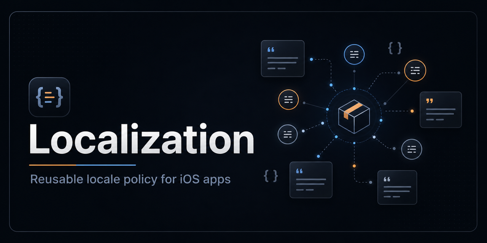

# Localization

[](https://github.com/Vadimkomis/localization/actions/workflows/ci.yml)
[](Package.swift)
[](#v1-locales)
[](Package.swift)
[](Package.swift)

Shared iOS 26 localization policy for app projects.

## Why this exists

Use this package as the single source of truth for the languages supported across iOS apps. It keeps the locale list, fallback assumptions, and validation helpers in one reusable Swift package instead of duplicating that policy in every app repo.

This package does not own app copy. Each app should still keep its translated strings in native Apple localization resources such as `.xcstrings`, `.strings`, or `.stringsdict`.

## V1 locales

- Source locale: `en-US`
- Target locales: `es`, `pt-BR`, `ja`, `de`, `fr`, `he`

## Installation

Add the package in Xcode:

```text
File -> Add Package Dependencies...
```

Use this repository URL:

```text
git@github.com:Vadimkomis/localization.git
```

Then add the `Localization` product to the app target or test target that needs the shared policy.

## Usage

Import the package wherever app code or tests need the supported locale policy:

```swift
import Localization
```

Read the source locale, target locales, or all supported locale identifiers:

```swift
let sourceLocale = LocalizationPolicy.sourceLocale
let targetLocales = LocalizationPolicy.targetLocales
let supportedIdentifiers = LocalizationPolicy.supportedLocaleIdentifiers
```

The V1 supported identifiers are stable and ordered with the source locale first:

```swift
[
    "en-US",
    "es",
    "pt-BR",
    "ja",
    "de",
    "fr",
    "he"
]
```

## Validating an app

Apps can use `LocalizationValidation` from their own tests to make sure their localization resources include every required locale.

```swift
import Testing
import Localization

@Test("app includes all required locales")
func appIncludesAllRequiredLocales() {
    let appLocaleIdentifiers = [
        "en-US",
        "es",
        "pt-BR",
        "ja",
        "de",
        "fr",
        "he"
    ]

    let result = LocalizationValidation.coverage(
        availableIdentifiers: appLocaleIdentifiers
    )

    #expect(result.isValid)
    #expect(result.missingLocales.isEmpty)
}
```

When Hebrew (`he`) is enabled, apps should also test right-to-left layout behavior for critical screens and controls.

## Social preview + README banner

This repo includes:

- `assets/banner.png` - used at the top of this README and suitable for GitHub Settings -> Social preview

GitHub's social preview guidance: keep the image under 1 MB; 1280x640 works best.

## Ownership boundary

- `Localization` owns shared locale policy and validation helpers.
- Each app owns its translated copy and Apple localization resources.
- Codex localization work should use this package instead of inventing a separate language list.
